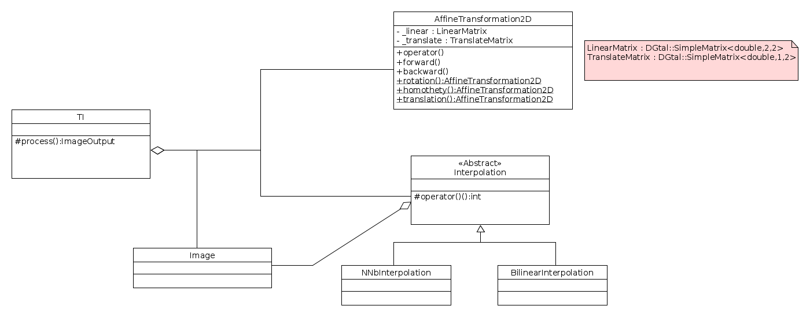

# Compte rendu de réunion
13/10/2021 

**Présents** :  Yukiko Kenmochi, Sebastien Fourey, Heithem Dridi, Sarah Brood

-----

**Réalisé :**
- lectures sur les interpolations 
- creation d'une premiere architecture 

**Mise au point :** 
- architecture : 
    

- Les transformations backwards seront toujours utilisées  
$` X =L^{-1}(Y-T) `$ avec $`X`$  l'image source $`L`$ la matrice de transformation linéaire, $`T`$ la matrice de translation et $`Y`$ l'image de sortie 

**Prochain objectif :**  

-implémenter l'achitecture vue plus haut

**Kick-Off :**  
Présentation de 10 minutes du projet, ses problématiques, état de l'art et objectifs. 
